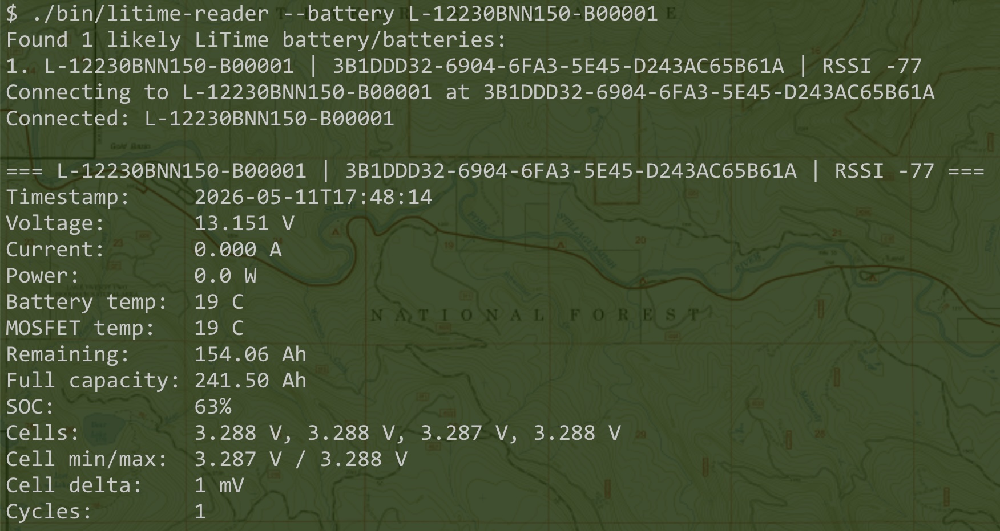

# GBL LiTime BLE Battery Monitor


Open-source interoperability with LiTime smart batteries through reverse-engineered Bluetooth Low Energy protocol.

**Credits**: This work builds upon the reverse engineering efforts of [chadj/litime-bluetooth-battery](https://github.com/chadj/litime-bluetooth-battery/).

## Features

- **BLE Protocol Support**: Custom LiTime BLE telemetry protocol implementation
- **Multi-Battery Monitoring**: Automatic scanning and identification of LiTime batteries
- **Multiple Output Formats**: Human-readable, JSON, CSV for different use cases
- **CLI Tooling**: Command-line interface with various options
- **Python API**: Programmatic access for integrations

## Installation

```bash
# Clone repository
git clone <repository-url>
cd gbl-litime-ble

# Create virtual environment
python3 -m venv .venv
source .venv/bin/activate

# Install dependencies
pip install -r requirements.txt
```

## Quick Start

```bash
# List available batteries
./bin/litime-reader --list-batteries

# Read battery data
./bin/litime-reader --battery-name "L-12230XXX-XXXXXXX" --once

# Continuous monitoring with log output
./bin/litime-reader --battery-name "L-12230XXX-XXXXXXX" --log battery.log
```

## CLI Options

  - --list-batteries      : Print discovered LiTime battery names only and exit.
  - --output {human,json,rawjson} : Output format. Use json for parsed rows, rawjson for packet analysis.
  - --interval INTERVAL :  Polling interval in seconds.
  - --scan-timeout SCAN_TIMEOUT : BLE scan timeout in seconds.
  - --read-timeout READ_TIMEOUT : Timeout for one-shot reads.
  - --once                : Read one state from each visible battery and exit.
  - --battery-name BATTERY_NAME : Filter visible batteries by name substring.
  - --address ADDRESS     : Filter visible batteries by Bluetooth address.
  - --log LOG            : Write one JSON line per battery state to this file.
  - --log-timezone TZ    : Timezone for log timestamps. Options: 'local' (system, default), 'utc', named zone (e.g., 'America/New_York'), or GMT offset (e.g., 'gmt+5').

## Output Formats

### Human-readable (default)

```
Battery: L-12230XXX-XXXXXXX
Total Voltage: 13.152 V
Cell Voltages: 3.288V, 3.288V, 3.288V, 3.288V
Timestamp: 2024-01-15 10:30:45
```

### JSON

```json
{
  "battery_name": "L-12230XXX-XXXXXXX",
  "total_voltage": 13.152,
  "cell_voltages": [3.288, 3.288, 3.288, 3.288],
  "timestamp": "2024-01-15T10:30:45Z"
}
```

### CSV

```csv
timestamp,battery_name,total_voltage,cell1,cell2,cell3,cell4
2024-01-15T10:30:45Z,L-12230XXX-XXXXXXX,13.152,3.288,3.288,3.288,3.288
```

## Python API

```python
from gbl_litime_ble import BatteryState, poll_battery, list_batteries

# List batteries
batteries = list_batteries()
print(f"Found: {batteries}")

# Poll battery
state = poll_battery("L-12230XXX-XXXXXXX")
print(f"Voltage: {state.total_voltage:.3f}V")
```

## Safety Notes

This project currently focuses on **telemetry READ access only**.

⚠️ **Caution**: Write/configuration operations should be treated cautiously. Potential risks include:

- Modifying BMS protection thresholds
- Disabling safety protections
- Hardware damage
- Unsafe charging/discharging conditions

No configuration write commands are currently documented or implemented.

## Compatibility

- **Battery**: LiTime 230Ah Smart Bluetooth LiFePO4 Battery
- **Platform**: macOS, Linux, Windows
- **Python**: 3.9+
- **BLE**: Requires Bluetooth 4.0+ adapter

## Documentation

- [Protocol Details](protocol.md)
- [Packet Format](packet-format.md)
- [Python Reader](python-reader.md)
- [Reverse Engineering](reverse-engineering-notes.md)
- [Victron Integration](victron-integration.md)
- [iOS App Roadmap](ios-app-roadmap.md)
- [Legal Notes](legal-notes.md)

